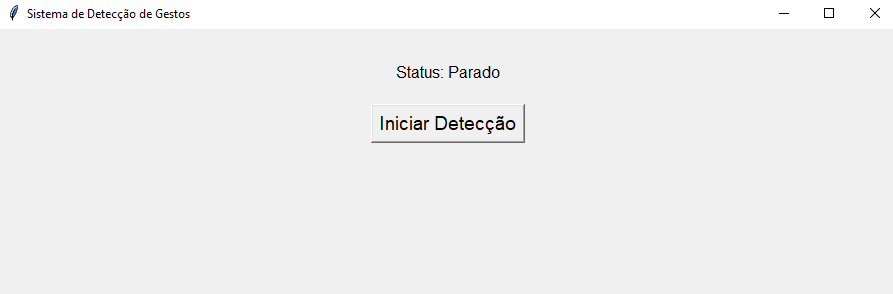
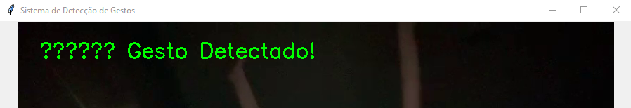

# EnergyAlert - Global Solution: Physical Computing: IoT & IOB

---

## 🌨️ Integrantes

Aline Fernandes - RM97966

Camilly Ishida - RM551474

Julia Leite - RM550201

---

## 🌨️ Descrição do problema

Atualmente, a população de diversos países precisa lidar constantemente com as quedas de energia em detrimento de fortes chuvas, falto de preparo, entre outros motivos. De acordo com o portal G1 (2025), apenas em 2024 foram feitos 5,7 milhões de chamados relativos à falta de luz no Brasil, além de o tempo de resposta para atendimentos de situações de emergência ter deteriorado.

Por consequência do ritmo acelerado e dependente das fontes energéticas em que vivemos, muitas pessoas precisam da energia para necessidades essenciais, como trabalhar ou estudar, sem contar os que precisam dela para, de fato, sobreviver, como no caso de pessoas que utilizam aparelhos hospitalares.

Em suma, a falta de energia é um problema que atinge diversos cidadãos em diversas escalas, e por isso, é necessário que a tecnologia possa ajudar na prevenção, solução ou auxílio nessas ocasiões.

---

## 🌨️ Visão Geral da Solução

Portanto, nossa solução consiste em uma aplicação baseada em visão computacional, capaz de identificar pessoas em perigo em locais enfrentando quedas de energia. O sistema emite sinais visuais e sonoros, como luzes ou alarmes, para auxiliar na orientação do indivíduo, além de registrar logs com data e hora dos eventos detectados. Essas informações podem ser acessadas por equipes especializadas, permitindo o envio de assistência física de forma mais rápida e eficiente.

### 🌨️ Requisitos

Antes de executar o programa, se certifique de ter instalado os pacotes Python a seguir:

```bash
pip install mediapipe opencv-python numpy pillow
```

### 🌨️ Como usar a aplicação

1. **Execute o programa principal**

Diretamente pela sua IDE de preferência, rode o arquivo `main.py`, ou abra o terminar, navegue até a pasta onde ele se encontra e execute:

```bash
   python main.py
```

2. **Inicie a detecção**

A interface gráfica será exibida com um botão, clique para ativar a câmera (ou o vídeo) e iniciar o monitoramento de gestos.



Ao levantar os dois braços, o sistema interpretará como uma situação de emergência, e as seguintes ações serão executadas:
- Um som de alerta será emitido, a fim de guiar o indivíduo pelo som
- Uma janela branca será aberta, simulando uma fonte de luz 
- Um registro com data e hora será salvo no arquivo logs.txt



Para encerrar a detecção, clique no outro botão. E para fechar a aplicação, apenas clique no "X" para fechar a tela.


> **Observação:** Para testar a aplicação com vídeo próprios, trocar o nome e localização do arquivo em `main.py`!

---

## 🌨️ Link do vídeo demonstrativo

Para acessar um vídeo demonstrativo e explicativo sobre o projeto [clique aqui]()!

---

## 🌨️ Referências

> G1. Falta de luz: brasileiros registram mais de 5 milhões de queixas contra distribuidoras em 2024. Jornal Nacional, 14 jan. 2025. Disponível em: https://g1.globo.com/jornal-nacional/noticia/2025/01/14/falta-de-luz-brasileiros-registram-mais-de-5-milhoes-de-queixas-contra-distribuidoras-em-2024.ghtml. Acesso em: 2 jun. 2025.

> G1. 'Desesperador, falta de humanidade': a vida de pessoas que precisam de energia elétrica para sobreviver em SP. São Paulo, 14 out. 2024. Disponível em: https://g1.globo.com/sp/sao-paulo/noticia/2024/10/14/desesperador-falta-de-humanidade-a-vida-de-pessoas-que-precisam-de-energia-eletrica-para-sobreviver-em-sp.ghtml. Acesso em: 2 jun. 2025.